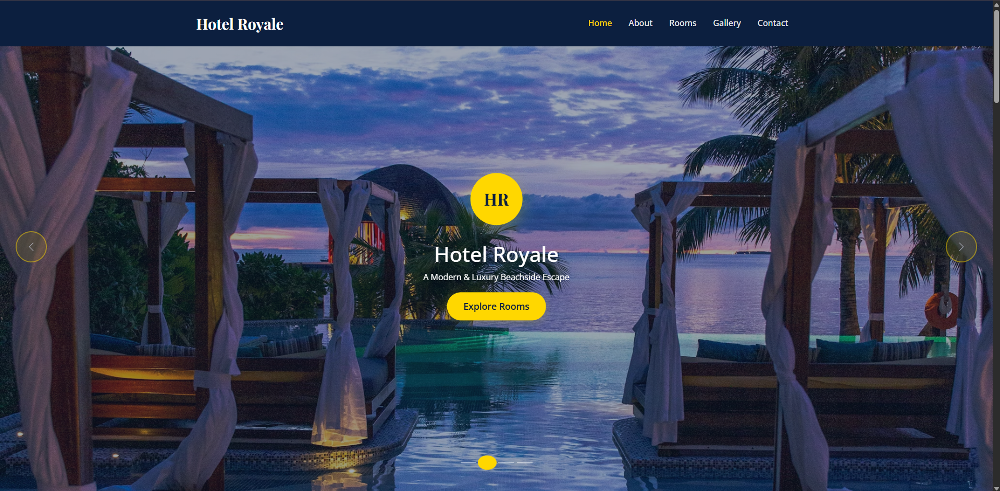

# Hotel Website



A modern, responsive hotel website with booking capabilities, room showcases, and administrative features.

[](https://github.com/Shachiru/hotel-website/blob/main/LICENSE)
[](https://github.com/Shachiru/hotel-website/issues)
[](https://github.com/Shachiru/hotel-website/stargazers)

## 📋 Table of Contents

- [Demo](#-demo)
- [Features](#-features)
- [Tech Stack](#-tech-stack)
- [Installation](#-installation)
- [Usage](#-usage)
- [Project Structure](#-project-structure)
- [API Documentation](#-api-documentation)
- [Contributing](#-contributing)
- [License](#-license)
- [Contact](#-contact)

## 🌐 Demo

Visit our live demo at [hotel-website-demo.netlify.app](https://hotel-website-demo.netlify.app)


## ✨ Features

- **User-facing Features**
  - Responsive design for all devices
  - Room browsing with detailed descriptions
  - Online booking system with real-time availability
  - Image gallery showcasing hotel amenities
  - Location map with nearby attractions
  - Customer reviews and testimonials
  - Contact forms and inquiry system

- **Administrative Features**
  - Secure admin dashboard
  - Booking management system
  - Room inventory control
  - Customer database
  - Content management system
  - Analytics and reporting

## 🛠️ Tech Stack

### Frontend
- HTML5, CSS3, JavaScript
- React.js
- Redux for state management
- Styled Components
- Material UI
- Responsive design with CSS Grid and Flexbox
- Mapbox for location services

### Backend
- Node.js
- Express.js
- MongoDB
- JWT for authentication
- Payment processing (Stripe integration)

### DevOps & Tools
- Git for version control
- GitHub Actions for CI/CD
- ESLint and Prettier for code formatting
- Jest and React Testing Library for testing
- Netlify/Vercel for frontend deployment
- Heroku/AWS for backend deployment

## 💻 Installation

### Prerequisites
- Node.js (v14.0.0 or higher)
- npm (v6.0.0 or higher)
- MongoDB (v4.0.0 or higher)

### Setup Instructions

1. Clone the repository
```bash
git clone https://github.com/Shachiru/hotel-website.git
cd hotel-website
```

2. Install dependencies
```bash
# Install frontend dependencies
cd client
npm install

# Install backend dependencies
cd ../server
npm install
```

3. Set up environment variables
```bash
# In the server directory, create a .env file
touch .env

# Add the following variables to the .env file
PORT=5000
MONGO_URI=your_mongodb_connection_string
JWT_SECRET=your_jwt_secret
STRIPE_SECRET_KEY=your_stripe_secret_key
```

4. Start the development servers
```bash
# Start the backend server
cd server
npm run dev

# In a new terminal, start the frontend server
cd client
npm start
```

The frontend should now be running on `http://localhost:3000` and the backend on `http://localhost:5000`.

## 🚀 Usage

### For Users
1. Browse hotel rooms and amenities
2. Create an account or log in
3. Book rooms with specific dates
4. Make secure payments
5. View booking history and receipts
6. Leave reviews after your stay

### For Administrators
1. Log in to the admin dashboard at `/admin`
2. Manage room inventory and pricing
3. View and process bookings
4. Respond to customer inquiries
5. Update website content
6. Generate reports and analytics

## 📁 Project Structure

```
hotel-website/
├── client/                  # Frontend code
│   ├── public/              # Static files
│   ├── src/                 # React components and logic
│   │   ├── assets/          # Images, fonts, etc.
│   │   ├── components/      # Reusable components
│   │   ├── context/         # React context
│   │   ├── hooks/           # Custom hooks
│   │   ├── pages/           # Page components
│   │   ├── redux/           # Redux store and slices
│   │   ├── services/        # API services
│   │   ├── utils/           # Utility functions
│   │   ├── App.js           # Main app component
│   │   └── index.js         # Entry point
│   └── package.json         # Frontend dependencies
│
├── server/                  # Backend code
│   ├── config/              # Configuration files
│   ├── controllers/         # Request handlers
│   ├── middleware/          # Custom middleware
│   ├── models/              # Database models
│   ├── routes/              # API routes
│   ├── utils/               # Utility functions
│   ├── server.js            # Entry point
│   └── package.json         # Backend dependencies
│
├── .gitignore               # Git ignore file
├── README.md                # Project documentation
└── LICENSE                  # License information
```

## 📚 API Documentation

API documentation is available at `/api/docs` when running the server locally. It includes all endpoints, request parameters, and response formats.

### Key Endpoints

- `GET /api/rooms` - Get all available rooms
- `GET /api/rooms/:id` - Get details for a specific room
- `POST /api/bookings` - Create a new booking
- `GET /api/bookings/user/:userId` - Get bookings for a specific user
- `POST /api/auth/register` - Register a new user
- `POST /api/auth/login` - Login existing user

## 🤝 Contributing

We welcome contributions to improve the hotel website! Please follow these steps:

1. Fork the repository
2. Create a new branch (`git checkout -b feature/amazing-feature`)
3. Make your changes
4. Run tests to ensure everything works
5. Commit your changes (`git commit -m 'Add some amazing feature'`)
6. Push to the branch (`git push origin feature/amazing-feature`)
7. Open a Pull Request

Please read our [CONTRIBUTING.md](CONTRIBUTING.md) for details on our code of conduct and the process for submitting pull requests.

## 📄 License

This project is licensed under the MIT License - see the [LICENSE](LICENSE) file for details.

## 📞 Contact

Shachiru - [GitHub Profile](https://github.com/Shachiru)

Project Link: [https://github.com/Shachiru/hotel-website](https://github.com/Shachiru/hotel-website)

---

Made with ❤️ by Shachiru
